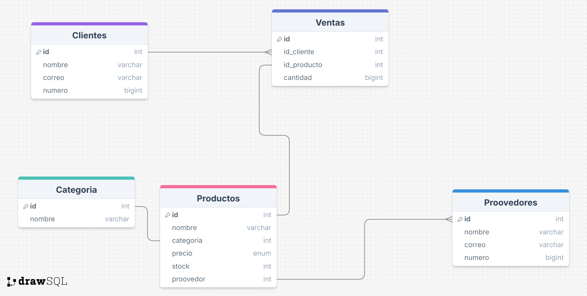

 <h1>TECH-ZONE

Tech-zone es una tienda de tecnologia que esta teniendo problemas con la gestión de su inventario y ventas ya que a medida que fue creciendo su metodo de ventas se fue desordenando hasta volverse un caos.

Hasta el momento han llevado un sistema de transacciones y manejo de datos mediante diferentes archivos de calculo que han ocasiado puntualmente los siguientes problemas.

## Errores en el control de stock
No saben con certeza que productos estan por agotarse, lo que ha llevado a problemas con el desabastecimiento o acumulacion innecesaria de productos en bodega.

## Dificultades en el seguimiento de ventas
No cuentan con un sistema eficiente para analizar que productos se venden mas, en que periodos del año hay mayor demanda o quienes son sus clientes mas frecuentes.

## Gestion manual de proveedores
Los pedidos a proveedores se han realizado sin un historial claro de compras y ventas, dificultado la negocion de mejores precios y la planificiacion del abastacimiento.

## Falta de automatizacion en el registro de compras
Cada vez que un cliente realiza una compra, los empleados deben registrar manualmente los productos vendidos y actualizar el inventario, lo que consume tiempo y es propenso a errores.

Para solucionar estos problemas se a decidido implementar una base de datos en PostgreSQL que permita gestionar de manera eficientee el inventario, ventas, clientes y proovedores.

## Modelo entidad relacion

Se preparo el siguiente modelo entidad relacion con el cual nos basaremos para la creacion de la base de datos.

## Modo de uso
1. Para poder usar la base de datos lo primero que necesitamos es tener instalado PostgreSQL en el equipo. Recomendamos la version 16.8 de postgres.
2. Clonar el repositorio de github y lo ideal es que sea en una carpeta de facil acceso.
3. Una vez clonado el repositorio procedemos a abrir PgAdmin4 que sera nuestro gestar de base de datos.
4. Crearemos una base de datos con el nombre que prefiera, recomendamos encarecidamente el nombre de Tech-zone.
5. Abrir el archivo db.sql que contiene todas las tablas de la base de datos y lo ejecutamos.
6. Una vez ejecutado seguiremos al archivo inserts.sql que contiene todas las inserciones necesarias para la base de datos.
7. Una vez hecho ya eres libre de navegar por la base de datos y probar las consultas y procedimientos que contiene la base de datos.

## Descriocion de archivos.

### db.sql
Contiene todas las tablas de la base de datos.

### insert.sql
Contiene las inserciones de la base de datos.

### ProcedureAndFunctions.sql
Contiene los procedimientos de la base de datos.

### queries.sql
Contiene las consultas de la base de datos.

## Como ejecutar una consulta
Una vez hiciste los pasos para la instalacion de la base de datos en tu equipo.

1. Dirigirse al archivo queries.sql que contiene las consultas y abrirlo con PgAdmin4.
2. Una vez abierto el archivo en el gestor hay dos formas de ejecutar una consulta, ejecutando todas de una vez o una por una seleccionandola y presionando ejecutar.

## Hecho por
Proyecto desarrollado por Jerxon Jair Correa Amaris estudiante de CampusLands Tibú.
